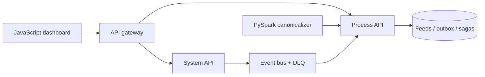

# Enterprise Integration Hub

**Flagship portfolio platform** for integration / backend interviews.

It is **not** Honeywell or Metasystems source code. It **is** a large, runnable system that implements the concepts companies keep putting in 2026 JDs: API-led connectivity, JWT, gateways, events, DLQ, sagas, Spark, Docker, Kubernetes, CI, and a JavaScript console.

[Architecture](docs/ARCHITECTURE.md) · [JD skill map](docs/JD-SKILL-MAP.md) · [Interview script](docs/INTERVIEW.md)



## What recruiters can click

| Surface | What you get |
|:--|:--|
| 800-row partner feed CSV | Multi-system, multi-region, multi-channel |
| System / Process / Experience APIs | MuleSoft-style API-led layout |
| JWT + API keys + rate limits | Auth story for gateway roles |
| Sagas + compensation + circuit breaker | Distributed workflow story |
| File event bus with inbox + DLQ | Kafka-shaped design that runs without a cluster |
| PySpark / pandas jobs + quality gates | Data engineering story |
| ASP.NET Core 8 ingest API | C# / .NET story |
| Docker Compose + Kubernetes YAML + Terraform notes | Cloud-native story |
| pytest + GitHub Actions | CI story |
| JavaScript ops console | Frontend / Experience API story |

## Quick start

```bash
python -m venv .venv
# Windows: .venv\Scripts\activate
pip install -r requirements.txt
python spark-pipeline/jobs/quality_checks.py
python spark-pipeline/jobs/ingest_feeds.py --pandas
pytest -q
uvicorn hub.app:app --port 8080
```

Open http://127.0.0.1:8080 — login `ananya` / `hub-demo`.

Click **Run batch ingest** to load all 800 canonical feeds.

```bash
# C# system API
cd api && dotnet run   # http://localhost:5080

# Gateway in front of process API
uvicorn hub.gateway:app --port 8088
```

```bash
docker compose up --build
```

## API map

| Method | Path | Layer |
|:--|:--|:--|
| POST | `/auth/login` | Auth |
| POST | `/system/v1/feeds` | System — idempotent ingest + saga |
| POST | `/process/v1/feeds/batch` | Process — canonical bulk load |
| POST | `/process/v1/webhooks` | Process — partner webhooks |
| POST | `/process/v1/events/drain` | Process — consume bus / DLQ |
| GET | `/experience/v1/feeds` | Experience |
| GET | `/experience/v1/summary` | Experience |
| GET | `/experience/v1/graphql?query=feeds` | Experience |
| GET | `/health` `/metrics` `/docs` | Ops |

## Stack

`Python` `FastAPI` `C#` `.NET 8` `JavaScript` `PySpark` `pandas` `SQLite` `JWT` `Docker` `Kubernetes` `GitHub Actions` `OpenAPI` `gRPC proto` `Terraform`

## Honest scope

Designed around production **patterns**. The sample is 800 synthetic rows on SQLite + a file bus. In an interview, map FileBus → Kafka, SQLite → Postgres, this gateway → Kong/APIM.
