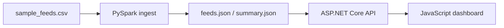

# Enterprise Integration Hub

Personal demo that connects three pieces of an integration stack:

1. **PySpark** job reads CSV feeds and writes JSON
2. **ASP.NET Core 8** REST API serves those feeds
3. **JavaScript** dashboard calls the API and renders KPIs / a feed table

This is a **portfolio project**, not proprietary Honeywell or Metasystems code.



## API

| Method | Path | Description |
|:--|:--|:--|
| GET | `/health` | Service heartbeat |
| GET | `/api/feeds` | All feeds (`?status=` and `?source=` filters) |
| GET | `/api/feeds/{feedId}` | One feed |
| GET | `/api/summary` | Aggregates from the Spark job |
| GET | `/` | JavaScript dashboard |

## Run

```bash
# 1) Produce API payloads (PySpark if installed, otherwise pandas)
cd spark-pipeline
python jobs/ingest_feeds.py

# 2) Serve API + dashboard
cd ../api
dotnet run
```

Open [http://localhost:5080](http://localhost:5080).

Force pandas:

```bash
python jobs/ingest_feeds.py --pandas
```

## Stack

`C#` `.NET 8` `ASP.NET Core` `JavaScript` `PySpark` `pandas` `REST`

## Notes for interviews

Walk through the path: CSV → Spark aggregates → JSON contract → .NET endpoints → `fetch()` in `wwwroot/app.js`. The sample dataset is synthetic.
