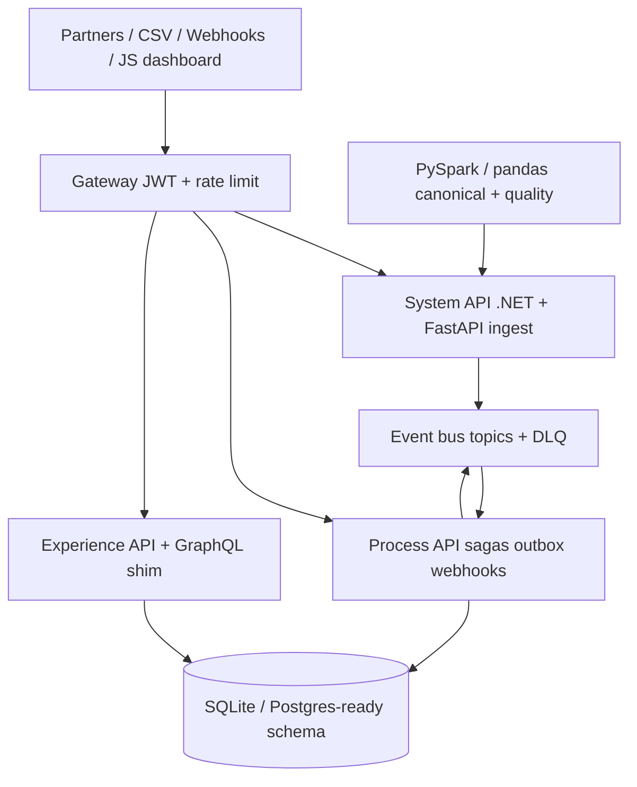

# Enterprise Integration Hub — Architecture

Portfolio platform that implements **API-led connectivity** (System / Process / Experience APIs), enterprise integration patterns, and a Spark canonicalization pipeline.

## Layers (MuleSoft-style API-led)

| Layer | Path prefix | Job |
|:--|:--|:--|
| Experience | `/experience/v1` | Dashboard queries, GraphQL shim, filters |
| Process | `/process/v1` | Batch canonical load, webhooks, event drain, sagas |
| System | `/system/v1` | Single-feed ingest with idempotency keys |

## Patterns implemented

- Canonical data model + message translator
- Content-based router
- Outbox + inbox (at-least-once, idempotent consume)
- Dead letter queue
- Orchestration saga with compensation
- Circuit breaker on notify path
- Idempotency-Key header
- API gateway proxy
- JWT + API keys
- Token-bucket rate limit
- Prometheus-style `/metrics`
- OpenAPI via FastAPI `/docs`
- gRPC contract in `proto/feeds.proto`
- Kubernetes probes + 2 replicas
- Docker Compose
- Terraform design output (not a live apply)

Sample data: **800** synthetic partner feeds across 6 source systems and 5 partners.
